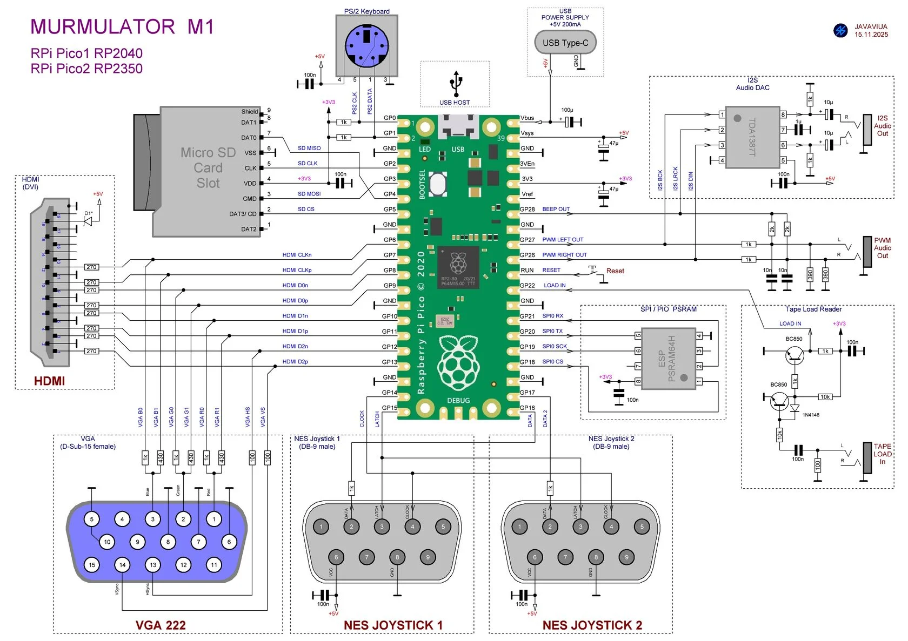
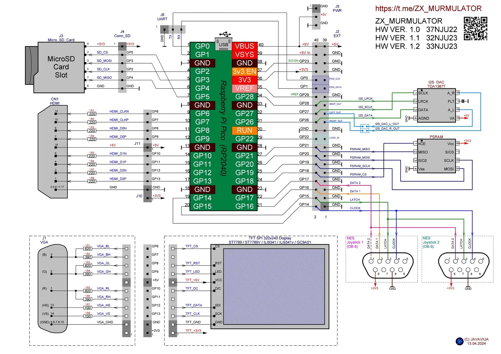
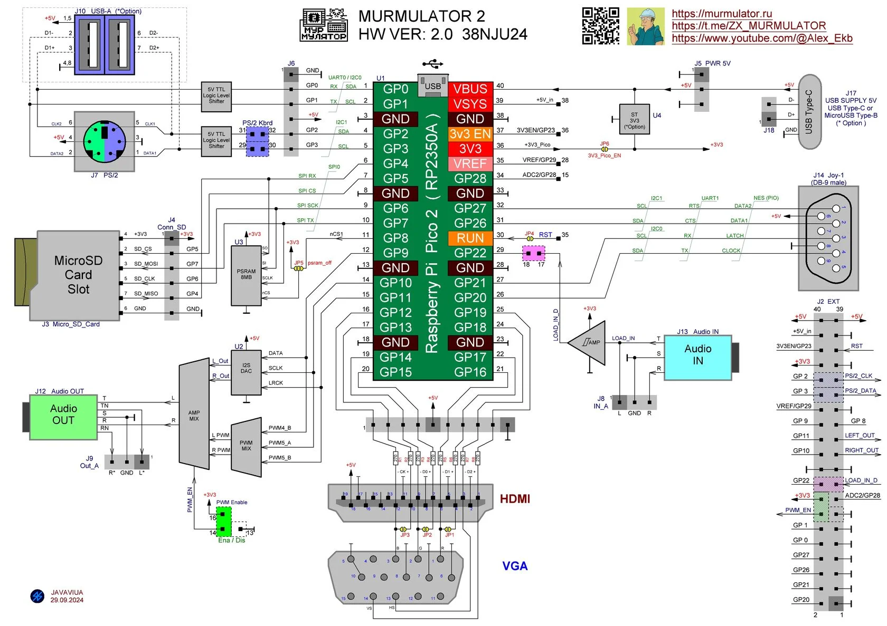

# SpeccyP 

  

**Эмулятор ZX Spectrum на базе микроконтроллеров Raspberry Pi RP2040 и RP2350A, RP2350B.**

Прошивка обеспечивает эмуляцию различных моделей Spectrum с поддержкой HDMI, VGA, TFT дисплеев, звука I2S, PSRAM, USB-мыши и геймпадов.

---
## 📄 Лицензия

Этот проект распространяется под лицензией **GNU General Public License v3.0** (GPL-3.0).

Вы можете свободно использовать, изменять и распространять данное программное обеспечение при условии соблюдения требований лицензии. Полный текст лицензии доступен в файле `LICENSE` или на сайте [https://www.gnu.org/licenses/gpl-3.0.html](https://www.gnu.org/licenses/gpl-3.0.html).
---
## 📦 Содержимое прошивки

- **Поддерживаемые платы**: m1p1, m1p2, m2p1, m2p2, z0p2 (RP2350B PiZero2).
- **Подробности по используемым платам** доступны на сайте [murmulator.ru](https://murmulator.ru).

---

## 🎮 Особенности

### Поддерживаемые модели ZX Spectrum
| Модель | Особенности |
|--------|-------------|
| **ZX Spectrum 48** | Оригинальное ПЗУ ZX Spectrum 48 |
| **Pentagon 128** | Классическая модель 128K |
| **Pentagon 512** | Порт #7FFD, биты 0,1,2,6,7 |
| **Pentagon 512CASH** | 32KB CASH, переключение по портам IN (0xFB) — включить, IN (0x7B) — выключить |
| **Pentagon 1024** | Порт #7FFD, биты 0,1,2,5,6,7 (5-й бит НЕ блокирует 48-й режим) |
| **Scorpion 256** | Порты #1FFD (бит 4) и #7FFD (биты 0,1,2) |
| **Scorpion GMX 2048** | Порты #DFFD (биты 0,1,2), #1FFD (бит 4), #7FFD (биты 0,1,2) |
| **Navigator 256** | Порт #7FFD, биты 0,1,2,6 |
| **MurmoZavr 8Mb** | Порт 0xAFF7 (биты 0-5) и #7FFD (биты 0,1,2) |

### Поддерживаемые видеовыходы
| Тип | Параметры |
|-----|----------|
| **HDMI** | 60 Гц с делителем 1.5, автоопределение |
| **VGA** | 60 Гц, автоопределение |
| **TFT** | ILI9341, ST7789 — настройка в Advanced Setup |

### Способы управления
| Устройство | Подключение | Особенности |
|------------|-------------|-------------|
| **PS/2 клавиатура** | Через USB-адаптер или напрямую (при наличии соответствующего интерфейса) | Полноценная эмуляция клавиатуры Spectrum |
| **USB клавиатура** | Через USB OTG на Pico | Поддержка стандартных USB HID-клавиатур |
| **USB мышь** | Через USB OTG на Pico | Режим Kemston Mouse, регулировка скорости в Advanced Setup |
| **NES джойстик** | Через соответствующий адаптер | Полная поддержка с дополнительными функциями (см. раздел "Управление") |
| **Геймпад Xbox** | Через USB OTG | Режим Kempston джойстика (кнопки и крестовина) |
| **Беспроводной геймпад** | Через USB OTG | Поддержка китайских беспроводных геймпадов в режиме Kempston |

### Эмулятор Z80
Используется точный эмулятор от [Manuel Sainz](https://github.com/redcode/Z80), поддерживающий все документированные и недокументированные функции процессора.

В **Advanced Menu** доступен выбор типа процессора (переключение "на лету"):
- ZILOG NMOS
- ZILOG CMOS
- NEC NMOS
- ST CMOS
- UNREAL (отключены настройки под тип CPU)

### Экран и видео
- **Регулировка начала первой строки** экрана (полезно для демок с бордерными эффектами).
  - `[Ctrl] + [F7]` — уменьшить значение
  - `[Ctrl] + [F8]` — увеличить значение

### Звук
- Регулировка громкости: `[F7]` (уменьшить), `[F8]` (увеличить) от 0 до 100%.
- Режимы звука: Soft AY-3-8910, Soft TurboSound, I2S AY-3-8910, I2S TurboSound.
- **BUSTER I2S** (усилитель для TDA) от 0 до 7 (по умолчанию 0 — без клиппинга).
- **Hard AY/TS** с генератором clock AY (f=1773000Гц) на GPIO 29.

### Аудио загрузка (TAPE LOADER)
- При загрузке TAP файла из файлового менеджера аудио загрузка **отключается**.
- Для восстановления необходимо выполнить **Hard Reset**.
- Уровень звука при аудио загрузке настраивается в Advanced Setup (0-15).

---

## 💾 Память (PSRAM)

Прошивки адаптированы для различных плат:

| Плата       | PSRAM подключение |
|-------------|-------------------|
| m1p2 (RP2350) | Бутербродная PSRAM GPIO 19 (A) или GPIO 47 (B) / SPI GPIO 18-21 |
| m1p1 (RP2040) | SPI PSRAM GPIO 18-21 |
| m2p2 (RP2350) | Бутербродная PSRAM CS GPIO 8 (A) или GPIO 47 (B) |
| m2p1 (RP2040) | Работает без PSRAM (только Spectrum 48/128) |

---

## 🕹️ Управление

### Горячие клавиши

| Клавиша | Действие |
|---------|----------|
| `[F1]` | Помощь (Help) |
| `[F2]` | Быстрое сохранение |
| `[F3]` | Загрузка сохранений |
| `[F5]` | Сохранить в slot 0 + сохранение конфигурации |
| `[F6]` | Смена палитры |
| `[F7]/[F8]` | Громкость вниз/вверх |
| `[F9]` | NMI (Scorpion/Navigator/Pentagon 512CASH) |
| `[F10]` | Режим Normal/Turbo/Fast (3.5MHz/Int50Hz, Fast/Int100Hz) |
| `[F11]/[Ins]` | Файловое меню |
| `[F12]/[Home]` | Меню настроек |
| `[END]` | Дизассемблер |
| `[Ctrl]+[Alt]+[Del]` | Soft Reset |
| `[Shift]+[Alt]+[Del]` | Hard Reset |
| `[Ctrl]+[F7]/[F8]` | Регулировка начала экрана |

**В файловом меню:**
- `[ENTER]` — монтировать TRD/SCL или подключить TAP
- `[SPACE]` — быстрый запуск TRD/SCL

### 🎮 NES джойстик
- `START + Стрелка вниз` — файловый браузер
- `START + Стрелка вверх` — меню настроек
- `START + Стрелка влево` — меню SAVE
- `START + Стрелка вправо` — меню LOAD
- `[A]` — выбор / `[B]` — запуск или выход

---

## ⚙️ Настройки и конфигурация

Все настройки сохраняются в файл **`speccy_p.cnf`** в корне SD-карты.

### Автостарт (AutoRUN)
Настраивается в меню `[F12]`:
- **File TR-DOS** — загрузка образа TRD/SCL с диска A
- **QuickSave Slot 0** — загрузка состояния из слота 0
- **OFF** — отключить автостарт

---

## 🖱️ Дополнительные возможности

- **USB-мышь** (Kemston Mouse) с регулировкой скорости.
- Поддержка **геймпада Xbox** (режим Kempston).
- Поддержка **китайских беспроводных геймпадов**.
- Пункт **Power OFF** — выключение с сохранением текущей конфигурации.
- **Update mode** — вход в режим обновления прошивки (аналог кнопки BOOT).

---

## 🧩 Использование ресурсов

### RP2350
| Память | Использовано | Всего | % |
|--------|--------------|-------|-----|
| FLASH  | 515884 B     | 4 MB  | 12.30% |
| RAM    | 244860 B     | 512 KB| 46.70% |

### RP2040
| Память | Использовано | Всего | % |
|--------|--------------|-------|-----|
| FLASH  | 411896 B     | 2 MB  | 19.64% |
| RAM    | 241484 B     | 256 KB| 92.12% |

---

## 📂 Прошивки

Для разных плат доступны скомпилированные прошивки в архивах:
- `m1p1`, `m1p2`, `m2p1`, `m2p2`
- `z0p2` (RP2350B PiZero2)

---

## 🙏 Благодарности
- **AlexEkb** — за идею эмулятора и изначальный код + драйвер HDMI ([AlexEkb](https://github.com/AlexEkb4ever))
- **murmulator.ru** — за поддержку и обратную связь [ZX_MURMULATOR](https://t.me/ZX_MURMULATOR)
- **Автору Fastbeta** — за поддержку и помощь в начале пути, но потом ты заблокировал меня, извини если что не так.(https://t.me/zxpipico)
- **Виталий Рудик** — за идею эмулятора TR-DOS (https://bitbucket.org/rudolff/fdcduino/src/master/)
- **Эмулятор Z80** от [Manuel Sainz](https://github.com/redcode/Z80)
- **Derek Fountain** — за идею и код очень быстрого обмена между двумя pico! [Derek Fountain](https://github.com/derekfountain/pico-pio-connect)
- **Автору прошивки** — за проделанную работу и "добавленные баги" ;)
---

## 🔗 Полезные ссылки
- [ZX_MURMULATOR](https://t.me/ZX_MURMULATOR) — телеграм канал
- [Сайт проекта murmulator.ru](https://murmulator.ru) — подробности по используемым платам и дополнительная информация
- [Репозиторий эмулятора Z80](https://github.com/redcode/Z80)

---

*Если вы забыли, как что-то работает — всегда есть `[F1]` Help.*

  
   
  <em>SpeccyP старт</em>

  
   
  <em>SpeccyP в работе</em>

  
   
  <em>SpeccyP в работе</em>

  
   
  <em>SpeccyP в работе</em>

  
   
  <em>SpeccyP в работе</em>

  
   
  <em>SpeccyP файловое меню</em>

  
   
  <em>MURMULATOR M1</em>

  
   
  <em>MURMULATOR M1 TFT</em>

  
   
  <em>MURMULATOR M2</em>

